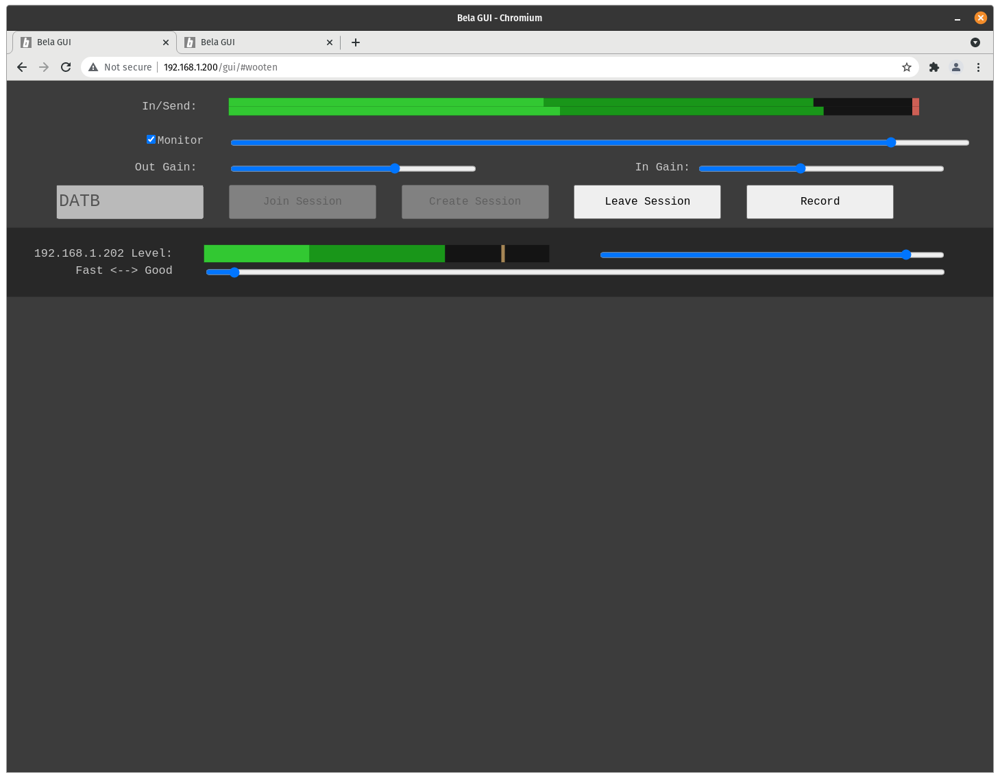

## wooten

A low-latency remote musical collaboration software project. Meant to run on a
[Bela](https://bela.io/).

Peer-to-peer session management is handled by the
[wooten server](https://github.com/smr-llc/wooten-server).

### Prerequisite: liquid-dsp

Build and install
[my fork of liquid-dsp](https://github.com/hello-adam/liquid-dsp), which sets
the right compiler flags for the beaglebone black.

```
cd ~
git clone https://github.com/hello-adam/liquid-dsp.git
cd liquid-dsp
./bootstrap.sh
./configure
make
make install
ldconfig
```


### Clone, build, run

```
cd ~
git clone https://github.com/hello-adam/wooten.git
cd wooten
./build.sh
```

Then navigate to the GUI in a web browser at `http://192.168.7.2/gui`


### Notes

Tested with Bela image 0.3.8b and 0.3.8e

Current tests show ~4ms round-trip latency on a LAN, and ~45ms round-trip from
Verizion FiOS (fiber) to Comcast XFinity (cable) in the Baltimore area.

Refer to bela docs for details on how to run a program at startup.

Please report bugs and ideas in the GitHub issues.

